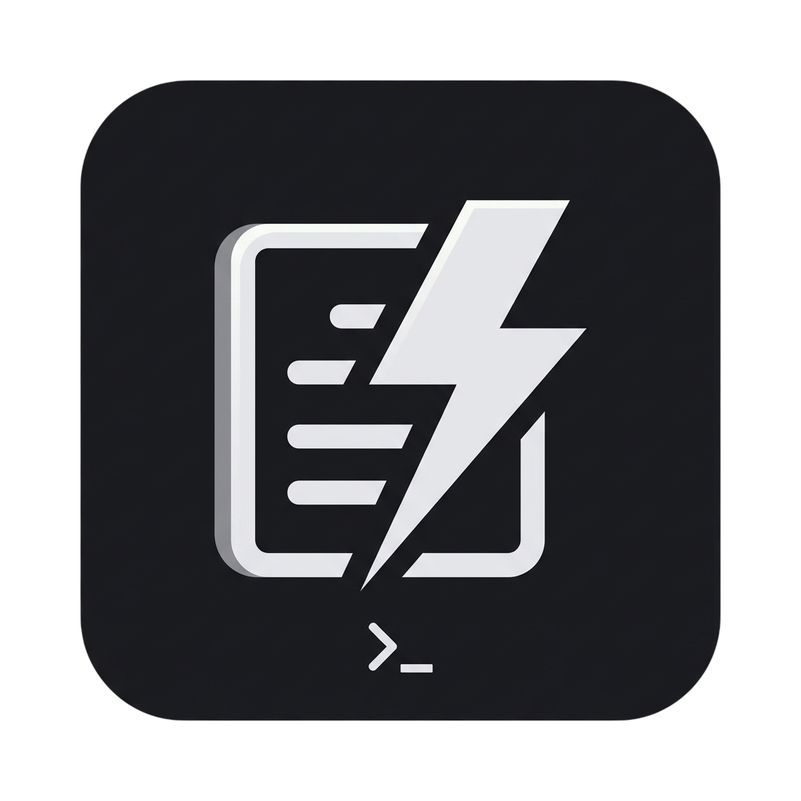
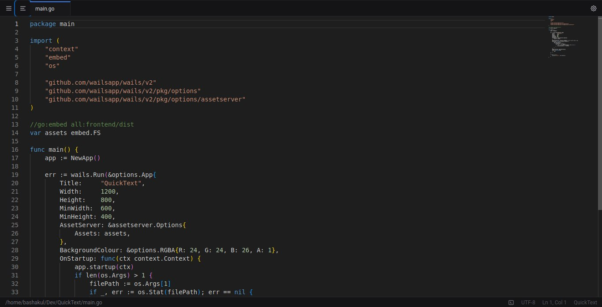

# QuickText

Лёгкий, быстрый и минималистичный текстовый редактор для Linux, созданный на **Wails v2** (Go + Vue 3).



## Возможности

- **Быстрое нативное редактирование** — Monaco Editor на фронтенде, Go на бэкенде для мгновенной работы с диском.
- **Вкладки** — открывайте и редактируйте несколько файлов одновременно, с индикатором несохранённых изменений для каждой вкладки.
- **Дерево файлов (сайдбар)** — просматривайте папки и переключайтесь между файлами.
- **Встроенный терминал** — эмулятор PTY-оболочки (`xterm.js`) с вашим стандартным шеллом.
- **Безопасное закрытие** — при попытке закрыть окно с несохранёнными изменениями появляется диалог *Сохранить / Выйти без сохранения / Отмена* вместо потери данных.
- **Горячие клавиши**
  - `Ctrl + S` — сохранить текущий файл
  - `Ctrl + O` — открыть файл
  - `Ctrl + F` — поиск (встроенный в Monaco)
  - `Ctrl + Колесико мыши` — масштабирование шрифта
- **Автосохранение** — несохранённая работа периодически сохраняется и восстанавливается при следующем запуске.
- **Тёмный минималистичный интерфейс** — тема в стиле Flat/Zinc на Tailwind CSS.

## Скриншот



## Технологический стек

| Слой        | Технология                                  |
| ----------- | ------------------------------------------- |
| Бэкенд      | Go 1.23 + [Wails v2](https://wails.io)     |
| Фронтенд    | Vue 3 (Composition API) + Vite + Tailwind  |
| Редактор    | Monaco Editor + xterm.js                    |

## Требования

- Go 1.23+
- Node.js + npm
- Wails CLI: `go install github.com/wailsapp/wails/v2/cmd/wails@latest`
- Зависимости сборки для Linux (GTK, webkit2gtk) — см. [Wails Linux prerequisites](https://wails.io/docs/gettingstarted/installation#linux).

## Разработка

Запуск в режиме live-reload:

```bash
wails dev
```

Запускается Vite-сервер с горячей перезагрузкой. Также доступен браузерный dev-сервер на `http://localhost:34115`.

## Сборка

Создание готовой к распространению production-сборки:

```bash
wails build
```

Исполняемый файл помещается в `build/bin/`. Для сборки Debian-пакета:

```bash
wails build -platform linux/amd64 -deb
```

## Структура проекта

```
.
├── main.go            # Точка входа Wails и настройки окна
├── app.go             # Бэкенд на Go: работа с файлами, терминал, автосохранение, безопасное закрытие
├── frontend/          # Фронтенд на Vue 3 + Vite
│   └── src/
│       ├── App.vue    # Вёрстка, вкладки, сайдбар, обработка закрытия
│       └── components/
├── build/             # Ассеты и упаковка сборки (иконки, инсталляторы)
└── wails.json         # Конфигурация проекта
```

## Лицензия

Распространяется под [GNU General Public License v3.0](LICENSE).

Copyright © 2026 PerfLite.

---

[English version](README.md)
